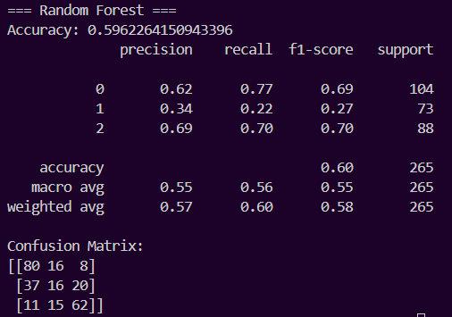
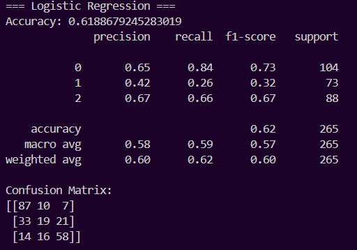
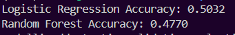

# MACHINE LEARNING PROJECT
# Linguaggio utilizzato: 
Python 

# Librerie utilizzate: 
- pandas 
- os 
- joblib

# File corretti finali: 
## Parte1: 
- train_modelli.py
- test_modelli.py
- usa_modelli.py 

## Parte2: 
- train_and_test.py
- usa_modelli.py 

# Dataset finali: 
## Parte1: 
- dataset_parte1.csv

## Parte 2: 
- match_e_quote_merged.csv
- payer_merged.csv
- statistiche_squadra_complete.csv

Questi tre dataset non sono stati mergiati poichè contenenti informazioni troppo differenti e ne sarebbe risultato un dataset con un sacco di entry ripetute o feature Nan. 

# Comandi: 
## Scaricare macchina virtuale: 
`sudo apt install python3.10-venv` o `sudo apt install python3-venv`
`python3 -m venv venv`
 
## Attivare la macchina virtuale:
`source venv/bin/activate`

## Dipendenze
`pip install pandas`
`pip install scikit-learn`

## Esecuzione: 

`python3 nomeFile.py `

# PROGETTO: 
- Come modelli di predizione sono stati utilizzati: 
    * **Modello di Logistica Multinomiale:**  
   Software che utilizza la regressione lineare per stimare i risultati futuri delle partite.

    * **Modello Random Forest:**  
   Software che sfrutta l'algoritmo Random Forest per la previsione dei risultati.

- Come dataset per addestrare i due modelli sono stati utilizzati: 
    * **Parte 1:** 
    Un dataset con poche informazioni ma distribuite su più stagione calcistiche (2022/23 e 2023/24)
    * **Parte 2:**
    Uno con molte più informazioni ma solo riguardanti la stagione calcistica 2023/24 
- Come dataset per testare i due modelli sono stati utilizzati: 
    * **Parte 1:** 
    Un nuovo dataset sempre con poche informazioni ma contenente le partite di una stagione futura a quelle utilizzate per il training (2024/25) 
    * **Parte 2:** 
    Essendo che per questo dataset non siamo riusciti a trovare un ulteriore dataset identico a livello di informazioni ma di stagioni differenti, abbiamo deciso di utilizzar la tecnica di cross-validation (spegare tecnica che non so)

- Per entrambe le versioni dei modelli è stato creato uno script per rendere possibile l'interazione da terminale con i modelli creati. Detto script richiede di inserire: 
    - le due squadre partecipanti 
    - La squadra delle due che gioca in casa (opzionale)
Resistuirà la predizione di entrambi i modelli su detta partita 

#  Creazione dataset passaggi: 
## Parte 1: 
Per il training, sono stati uniti due dataset contenenti le stesse feature ma di stagioni differenti (22/23 e 23/24). Essendo che entrambi i dataset avevano uguali feature, l'unione è stata fatta senza riscontrare problematiche in virtù del fatto che i dataset sono stati prelevati dal medesimo luogo: 
**inserire link** 
Per il testing, è stato utilizzato un ulteriore dataset prelevato dal medesimo luogo dei dataset di training e quindi avente le medesime feature. Portandone ad un utilizzo senza alcuna problematica. 

## Parte 2: 
A differenza della parte 1, per sia per la fase di training che per la fase di testing, sono stati creati  tre dataset a partire da diversi altri dataset: 
- ### DATASET SULLE SQUADRE: 
Abbiamo riscontrato molte difficoltà causa le diverse incoerenze presenti tra i vari dataset (nomi feature differenti, nomi squadre differenti) e per l'unione di feature uguali in un'unica feature nel dataset finale. 
- ### DATASET SUI MATCH:  
Sono stati inizialmente modificati i due dataset di base prima dell'unione. In particolare: 
- Nel dataset 2023 sono state rimosse le colonne Date e Time in favore di una nuova colonna UTC Time così da rendere possibile il merging tramite anche UTC Time. 
- Nel dataset Serie a_matches_23_24, sempre per rendere possibile il merging, sono stati tolti gli spazi dai nomi delle colonne 'HomeTeam' e 'AwayTeam' 
Questo mering è stato complesso poichè doveva unire due dataset molto differenti ma con le modifiche apportate prima dell'unione è stato fatto senza intoppi 
- ### DATASET SUI GIOCATORI: 
Essendo stato l'ultimo dataset creato, abbiamo riscontrato meno difficoltà nel risolvere le molte incoerenze presenti nei dataset di partenza ma è comunque stato il più complesso da costruire per la presenza di suddette incoerenze (nomi feature differenti, feature ripetute solo in alcuni dataset e con nomi differenti)
I dataset utilizzati per la sua creazione sono presenti nella cartella [player](parte2/estratti_zip/serieA23-24/SerieA23_24/player). 
Per unire i vari dataset è stato utilizzato lo script [merge_player.py](parte2/merge_player.py). 

Per poter eseguire gli script bisogna entrare nella cartella dove si trovano detti script. 

# SCREENSHOTS ACCURACY: 
## PARTE 1: 
### RANDOM FOREST: 

### LOGISTIC REGRESSION: 

## PARTE 2: 

# Previsione Risultati Partite
## Parte 1: 
La versione 1 prevede l'utilizzo di un dataset ottenuto dal merge di due dataset contenenti informazioni sulle partite e sui bet relativi alle stagioni sportive 22/23 e 23/24. L'obiettivo è sviluppare due software in grado di prevedere i risultati delle prossime partite:

1. **Modello di Logistica Multinomiale:**  
   Un software che utilizza la regressione lineare per stimare i risultati futuri delle partite.

2. **Modello Random Forest:**  
   Un software che sfrutta l'algoritmo Random Forest per la previsione dei risultati.

Entrambi i modelli saranno addestrati sul dataset combinato e confrontati in termini di accuratezza e prestazioni.

## Parte 2: 
La versione 2 prevede l'utilizzo di un dataset ottenuto dal merge di due dataset: uno contenente informazioni dettagliate sulle partite e uno relativo ai bet, entrambi riferiti esclusivamente alla stagione 23/24.

L'obiettivo è sviluppare due software in grado di prevedere i risultati delle prossime partite:

1. **Modello di Logistica Multinomiale:**  
   Software che utilizza la regressione lineare per stimare i risultati futuri delle partite.

2. **Modello Random Forest:**  
   Software che sfrutta l'algoritmo Random Forest per la previsione dei risultati.

Entrambi i modelli saranno addestrati sul dataset combinato e confrontati in termini di accuratezza e prestazioni.
